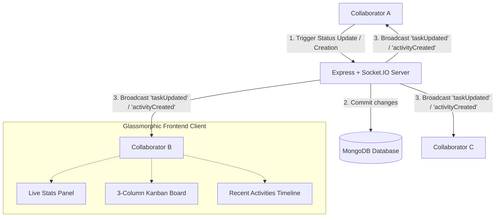

# 🌟 Taskly — Real-Time Collaborative Kanban Board

Taskly is a premium, state-of-the-art MERN (MongoDB, Express, React, Node.js) stack task management application designed for real-time team collaboration. Built with **TypeScript** and **Socket.IO**, the application features a gorgeous, high-fidelity dark glassmorphic dashboard, live database statistics, an automated activity logging feed, and instant collaborative synchronization without authentication friction.

---

## 🚀 Key Features

*   🎨 **Premium Glassmorphic UI**: High-fidelity dark mode designed with a unified HSL color system, sleek card components, glass panel filters, smooth hover animations, and subtle micro-interactions.
*   ⚡ **Real-Time Collaboration**: Dynamic, zero-latency sync of task movements, live statistics, and activities across all open browser sessions using Socket.IO.
*   📊 **Dynamic Live Statistics**: Top-level database stats syncing instantly on changes:
    *   **Total Tasks** count
    *   **Todo**, **In-Progress**, and **Completed** task states
    *   **Top Tag** indicator dynamically determined via a MongoDB aggregation pipeline
*   📋 **Kanban Board Board**: Elegant three-column interactive layout (**Todo**, **In Progress**, **Completed**) with drop-down status controllers that propagate changes instantly.
*   🔔 **Reactive Toast Notifications**: Floating micro-notifications alerting users in real time when any collaborator creates a task or changes a task's status.
*   📝 **Live Feed Logs**: A persistent, real-time scrollable logging sidebar capturing task additions and state changes with custom timeline icons and precise timestamps.
*   🔒 **Zero-Auth Collaborative Design**: Completely open dashboard design with no authentication walls, tailored for fast-paced corporate standups and frictionless pair testing.

---

## 🛠️ Tech Stack

### Frontend (`client`)
*   **React** (Vite-powered SPA) & **TypeScript**
*   **Socket.IO Client** for WebSocket connection management
*   **Axios** for clean REST API handling
*   **Vanilla CSS** custom-designed properties for theme tokens and responsive glassmorphic cards (no bulky frameworks)

### Backend (`server`)
*   **Node.js** & **Express** with **TypeScript**
*   **Mongoose** & **MongoDB** for robust object modeling and aggregate pipelines
*   **Socket.IO** server engine for pub/sub WebSocket messaging

---

## 📡 Architecture & Data Flow

The following diagram illustrates how state operations flow dynamically between collaborators and the database server:



---

## 🗄️ Database Schemas

The backend manages data structures through Mongoose models:

### 1. Task Schema (`Task.ts`)
| Field | Type | Required | Default | Description |
| :--- | :--- | :---: | :--- | :--- |
| `title` | `String` | **Yes** | — | The headline or name of the task. |
| `description` | `String` | No | `""` | Additional details or specifications. |
| `status` | `String` | **Yes** | `"todo"` | Task state: `"todo" \| "in-progress" \| "done"`. |
| `tags` | `[String]` | No | `[]` | Comma-separated categorization tags. |
| `createdAt` | `Date` | — | `Date.now()` | Automated creation timestamp. |
| `updatedAt` | `Date` | — | `Date.now()` | Automated modification timestamp. |

### 2. Activity Schema (`Activity.ts`)
| Field | Type | Required | Default | Description |
| :--- | :--- | :---: | :--- | :--- |
| `taskId` | `ObjectId` | **Yes** | — | Reference key of the affected task. |
| `taskTitle` | `String` | **Yes** | — | Snapshot title of the task. |
| `action` | `String` | **Yes** | — | Action verb: `"taskCreated" \| "taskUpdated"`. |
| `details` | `String` | **Yes** | — | Human-readable log description. |
| `createdAt` | `Date` | — | `Date.now()` | Log generation timestamp. |

---

## 🔌 API Reference

All routes are prefixed with `/api` and are fully public.

### Tasks & Activities

| Method | Endpoint | Request Body | Description |
| :---: | :--- | :--- | :--- |
| **GET** | `/tasks` | *None* | Retrieve all tasks sorted by creation date (newest first). |
| **POST** | `/tasks` | `{ title, description, status, tags }` | Create a new task and trigger real-time broadasts. |
| **PATCH** | `/tasks/:id/status` | `{ status }` | Modify the status of a specific task. |
| **GET** | `/stats` | *None* | Fetch calculated task counts and the top aggregated tag. |
| **GET** | `/activities` | *None* | Retrieve the latest 30 logged events from the feed. |

---

## 📡 WebSocket Event Registry

Socket.IO messages are emitted to all connected browser connections:

*   `taskCreated` (Payload: `Task` object) — Broadcasted when a new task is added.
*   `taskUpdated` (Payload: `Task` object) — Broadcasted when a task's status is toggled.
*   `activityCreated` (Payload: `Activity` object) — Broadcasted alongside task changes to update the live timeline log.

---

## 🚀 Setup & Installation

### Backend Setup (`server`)

1.  Navigate to the server directory:
    ```bash
    cd server
    ```
2.  Install dependencies:
    ```bash
    npm install
    ```
3.  Configure environmental variables:
    Create a `.env` file (copying from `.env.example`) and configure your MongoDB connection string and port:
    ```env
    PORT=5000
    MONGODB_URI=mongodb://localhost:27017/taskmanagement
    ```
4.  Run in development mode:
    ```bash
    npm run dev
    ```
    The server will startup on `http://localhost:5000` with hot-reloading enabled.

### Frontend Setup (`client`)

1.  Navigate to the client directory:
    ```bash
    cd client
    ```
2.  Install dependencies:
    ```bash
    npm install
    ```
3.  Configure environmental variables:
    Create a `.env` file pointing to the backend endpoints:
    ```env
    VITE_API_BASE_URL=http://localhost:5000/api
    VITE_SOCKET_URL=http://localhost:5000
    ```
4.  Run in development mode:
    ```bash
    npm run dev
    ```
    Vite will launch the local dashboard server on `http://localhost:5173`. Open this URL in multiple browser tabs to watch real-time synchronizations and live toast interactions in action!
